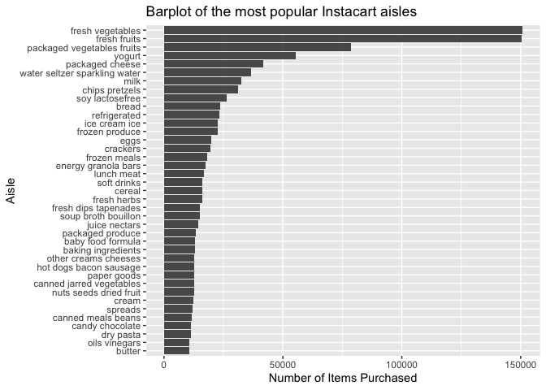
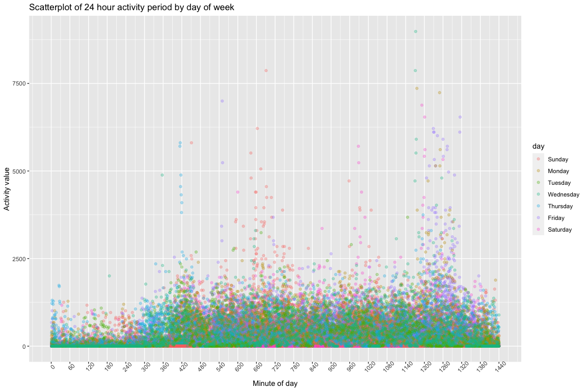

p8105_hw3_rs4390
================
Rae Spriggs
2022-10-07

``` r
library(tidyverse)
library(ggridges)
library(dplyr)
```

# Problem 1

``` r
library(p8105.datasets)
data("instacart")
```

## Dataset description

The `instacart` dataset contains 1384617 observations of individual
products from Instacart orders. There are 15 total variables that detail
the order information, product information, and user ID as seen below:

-   `order_id`: order identifier
-   `product_id`: product identifier
-   `add_to_cart_order`: order in which each product was added to cart
-   `reordered`: 1 if this product has been ordered by this user in the
    past, 0 otherwise
-   `user_id`: customer identifier
-   `eval_set`: which evaluation set this order belongs in
-   `order_number`: the order sequence number for this user (1=first,
    n=nth)
-   `order_dow`: the day of the week on which the order was placed
-   `order_hour_of_day`: the hour of the day on which the order was
    placed
-   `days_since_prior_order`: days since the last order, capped at 30,
    NA if order_number=1
-   `product_name`: name of the product
-   `aisle_id`: aisle identifier
-   `department_id`: department identifier
-   `aisle`: the name of the aisle
-   `department`: the name of the department

For example, observation \#417 (row 417 in `instacart`) details the
ordering of red peppers, which were found in the fresh vegetables
`aisle` in the produce `department`. This product was added to the cart
16th (out of 17 total items). The order was placed in the 17th hour of
the day, and it had been at least 30 days since `user_id` 163023’s last
order.

## How many aisles are there, and which aisles are the most items ordered from?

``` r
aisles_distinct = instacart %>% 
  distinct(aisle)

most_ordered = instacart %>% 
  group_by(aisle, aisle_id) %>% 
  summarize(n_obs = n())
```

There are 134 aisles. The fresh vegetables aisle (aisle_id 83) and fresh
fruits aisle (aisle_id 24) have the most items ordered with n being \>
150000 each.

## Making a plot for items ordered

``` r
grouped = instacart %>% 
  group_by(aisle) %>% 
  summarize(aisle_count = n()) %>% 
  filter(aisle_count > 10000)

  ggplot(grouped, aes(x = (reorder(aisle, aisle_count)), y = aisle_count)) +
    geom_bar(stat = "identity") + 
      labs(
    x = "Aisle",
    y = "Number of Items Purchased",
    title = "Barplot of the most popular Instacart aisles") + 
    viridis::scale_color_viridis(
    name = "Aisle", 
    discrete = TRUE) + 
    coord_flip()
```

<!-- -->

## Table for most popular items in three aisles

``` r
three_aisles = instacart %>% 
  group_by(aisle, product_name) %>% 
  summarize(aisle_count = n()) %>% 
  filter(aisle == 'baking ingredients' | aisle == 'dog food care' | aisle == 'packaged vegetables fruits') %>% 
  arrange(desc(aisle_count)) %>% 
  slice(1:3) 

three_aisles
```

    ## # A tibble: 9 × 3
    ## # Groups:   aisle [3]
    ##   aisle                      product_name                                aisle…¹
    ##   <chr>                      <chr>                                         <int>
    ## 1 baking ingredients         Light Brown Sugar                               499
    ## 2 baking ingredients         Pure Baking Soda                                387
    ## 3 baking ingredients         Cane Sugar                                      336
    ## 4 dog food care              Snack Sticks Chicken & Rice Recipe Dog Tre…      30
    ## 5 dog food care              Organix Chicken & Brown Rice Recipe              28
    ## 6 dog food care              Small Dog Biscuits                               26
    ## 7 packaged vegetables fruits Organic Baby Spinach                           9784
    ## 8 packaged vegetables fruits Organic Raspberries                            5546
    ## 9 packaged vegetables fruits Organic Blueberries                            4966
    ## # … with abbreviated variable name ¹​aisle_count

## Mean hour of day

``` r
mean_hour = instacart %>% 
  group_by(product_name, order_dow, order_hour_of_day) %>% 
  mutate(order_dow = recode(order_dow, `0` = "Sun", `1` = "Mon", `2` = "Tue", `3` = "Wed", `4` = "Thu", `5` = "Fri", `6` = "Sat")) %>% 
  filter(product_name == 'Pink Lady Apples' | product_name == 'Coffee Ice Cream') %>% 
  select(product_name, order_dow, order_hour_of_day) %>% 
  group_by(product_name, order_dow) %>% 
  summarize(mean_hour_of_day = mean(order_hour_of_day, na.rm = TRUE)) %>% 
  pivot_wider(
    names_from = 'order_dow',
    values_from = 'mean_hour_of_day'
  ) %>% 
  select('Sun', 'Mon', 'Tue', 'Wed', 'Thu', 'Fri', 'Sat')

mean_hour
```

    ## # A tibble: 2 × 8
    ## # Groups:   product_name [2]
    ##   product_name       Sun   Mon   Tue   Wed   Thu   Fri   Sat
    ##   <chr>            <dbl> <dbl> <dbl> <dbl> <dbl> <dbl> <dbl>
    ## 1 Coffee Ice Cream  13.8  14.3  15.4  15.3  15.2  12.3  13.8
    ## 2 Pink Lady Apples  13.4  11.4  11.7  14.2  11.6  12.8  11.9

# Problem 2

``` r
accel_data = read_csv('data/accel_data.csv') %>% 
  janitor:: clean_names() %>% 
  pivot_longer(
    activity_1:activity_1440, 
    names_to = 'activity', 
    values_to = 'minutes') %>% 
  mutate(day_type = recode(day, "Monday" = "weekday", "Tuesday" = "weekday", "Wednesday" = "weekday", "Thursday" = "weekday", "Friday" = "weekday", "Saturday" = "weekend", "Sunday" = "weekend")) %>% 
  mutate(day = factor(day, levels = c("Sunday", "Monday", "Tuesday", "Wednesday", "Thursday", "Friday", "Saturday")), day_type = factor(day_type))
```

## Dataset description

The accel_data dataset contains 50400 observations of length of time
spent doing various activities for the 63 year-old male being measured
over 35 days. There are 6 total variables that detail each activity and
the `week` it was measured, the `day` of the week, the `day_id` of the
study out of 35 days, whether it was a weekday or weekend (`day_type`),
and the `minutes` spent doing the activity. The resulting dataset has
dimensions described above, which are 50400 rows x 6 columns.

## Total activity for each day

``` r
total_activity = 
  accel_data %>% 
  group_by(day) %>% 
  summarize(total_activity = sum(minutes))

total_activity
```

    ## # A tibble: 7 × 2
    ##   day       total_activity
    ##   <fct>              <dbl>
    ## 1 Sunday          1919213 
    ## 2 Monday          1858699.
    ## 3 Tuesday         1799238.
    ## 4 Wednesday       2129772.
    ## 5 Thursday        2091151.
    ## 6 Friday          2291711.
    ## 7 Saturday        1369237

Wednesdays, Thursdays, and Fridays have the highest activity minutes out
of all the days of the week. Saturday has the lowest activity minutes.

## Plot of 24 hour activity time on each day

``` r
accel_data %>%  
  group_by(day, activity) %>% 
  summarize(
    mean_minutes = mean(minutes)) %>% 
  ggplot(aes(x = activity, y = mean_minutes, color = day)) + 
  geom_point(alpha=0.5) 
```

    ## `summarise()` has grouped output by 'day'. You can override using the `.groups`
    ## argument.

<!-- -->
